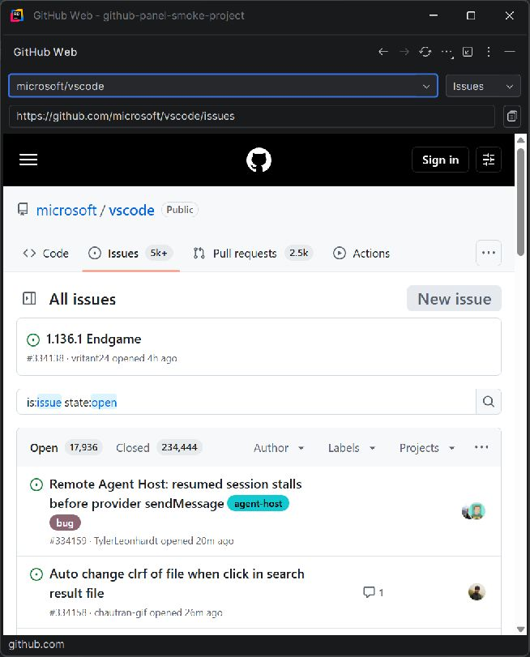

# GitHub Web Panel

[](https://github.com/ark4ez/github-web-panel/actions/workflows/verify.yml)

GitHub's website beside your code, with the current repository selected from Git remotes.

**0.2.0-beta.5 · MIT · ark4ez**

Independent project, not affiliated with GitHub or JetBrains. This beta is undergoing release validation.

Includes compact navigation, a copyable address bar, and repository-aware startup. See [startup acceptance](validation/UI-beta.5.md), [address bar acceptance](validation/UI-beta.4.md) and [compact UI acceptance](validation/UI-beta.3.md) for the checked scope of each version.



The panel can stay docked beside your editor or use Rider's **View Mode → Window**. The screenshot shows a public repository while signed out. [Copying an individual Issue URL](docs/images/copy-issue-url.png) is also supported.

## Scope

Local **Rider 2026.2.1 (262.9437.287) or newer 262.* builds on Windows**, using the bundled JetBrains Runtime and Web Browser (JCEF) plugin. Only 2026.2.1 is currently available for local verification. Other operating systems, GitHub Enterprise and remote development are outside this beta's declared scope.

- Actual GitHub Issues, PR and Projects pages.
- Repository discovery from HTTPS/SSH github.com Git remotes; no git subprocess or fetch.
- First-use connection choice, native Rider title-bar actions and a compact repository/section row.
- Back/forward, reload, page search, zoom/reset and external-browser action.
- Remember repository/section/zoom; preserve the current page when Git remotes change.
- Wait for Rider's initial Git models before choosing the landing page; explicit navigation takes priority.
- HTTP 403/404/network guidance; external HTTPS links need an explicit action.

## Install / update

This source beta is not yet listed on JetBrains Marketplace and has no tagged release. Build it locally with the commands below, or open a **successful main-branch run** in [Verify plugin](https://github.com/ark4ez/github-web-panel/actions/workflows/verify.yml) and download its `plugin-package` artifact (GitHub sign-in required). Extract that artifact once to obtain the installable plugin ZIP and its `SHA256SUMS.txt`. CI artifacts expire after 14 days. A green CI run verifies automated checks, not the remaining interactive acceptance.

1. In Rider open **Settings → Plugins → gear → Install Plugin from Disk**.
2. Choose `github-web-panel-0.2.0-beta.5.zip`, without extracting it. It updates the 0.1.0 prototype with the same plugin ID.
3. Restart only if Rider requests it. Open **View → Tool Windows → GitHub Web**.
4. Read the first-use notice and choose **Open GitHub**. Resize or move the tool window for a wider GitHub layout; the section selector stays beside the repository. Back, Forward and Reload are in the title bar.
5. Choose **More (⋯) → Sign in to GitHub** for private repositories. Enter passwords/2FA directly on GitHub yourself.

A 404 can mean the page is absent or the account lacks access. After signing in, choose Issues or PR again. Do not assume a 404 always means logged out.

**More → Find on page** searches within the page; Enter finds the next match and Escape closes search when the search field is focused. History shortcuts are Alt+Left/Right when focus is in Swing controls; native web focus behavior is runtime-dependent.

The read-only address bar follows the current page. Select its text and copy, or click **Copy URL** on the right to paste the exact link into another app. Copying is explicit; full URLs are not saved in plugin preferences.

## Sessions and limits

No PAT is required, and the plugin does not export cookies or inject JavaScript. **This does not mean no authentication data is stored:** Rider/JCEF manages web cookies/cache, possibly shared with other embedded IDE browsers. Chrome/Edge login is separate. Read [PRIVACY.md](PRIVACY.md).

External SSO, GitHub Enterprise and pop-up based external login are unsupported. Sandbox testing confirmed private repository access after a full Rider restart, issue creation, comment submission and a small text-file upload. Attachment downloads inside JCEF did not complete in this environment; recognized attachment links offer an explicit action to open the original GitHub URL in your system browser, which may require a separate login. Session expiration/account switching, passkeys, other file types and sustained performance still require acceptance testing. See [VALIDATION.md](VALIDATION.md) for the scope and provenance of checks. There is no telemetry collecting such results.

Uninstall in Settings → Plugins. Sign out of GitHub first if needed; uninstalling does not guarantee cookie deletion. Do not clear global Rider browser storage to implement a plugin-specific logout.

## Build and verify

The canonical build pins Gradle 9.1.0 (with SHA-256), IntelliJ Platform Gradle Plugin 2.18.1 and Rider 2026.2.1. Use Java 21 or newer; local development uses Rider's Java 25 runtime.

```powershell
# Downloads the pinned Rider distribution and tools on first use.
./gradlew.bat check buildPlugin verifyPlugin

# Reuse an installed Rider to avoid downloading another copy.
./gradlew.bat '-PlocalRider=C:/path/to/Rider' check buildPlugin verifyPlugin
```

The ZIP is under `build/distributions/`; binary compatibility reports are under `build/reports/pluginVerifier/`. `check` runs account-free URL, preference and toolbar-layout regressions. Archives use stable ordering/timestamps. CI contains no publication credentials or automatic release job.

For a quick Windows build with **no dependency downloads**, `./build.ps1` compiles against the installed Rider and runs the same regressions. This fallback does **not** replace Plugin Verifier.

```powershell
./run-sandbox.ps1 -SandboxDirectory 'C:/path/to/work/rider-sandbox' -Smoke
```

The sandbox has separate configuration, system, log and plugin paths. It creates an empty fixture repository with a public GitHub remote. `-Smoke` bypasses onboarding only in this disposable fixture and logs public-page readiness. Its fixture code is **never** included in the production ZIP. Omit `-Smoke` to test ordinary first-run behavior. Do not import personal Rider settings into this sandbox.

## Contribute / release

Maintained by [ark4ez](https://github.com/ark4ez) at [ark4ez/github-web-panel](https://github.com/ark4ez/github-web-panel). Use [Issues](https://github.com/ark4ez/github-web-panel/issues) for bugs and questions, and [private vulnerability reporting](https://github.com/ark4ez/github-web-panel/security/advisories/new) for suspected security flaws. See [CONTRIBUTING.md](CONTRIBUTING.md), [SECURITY.md](SECURITY.md), [RELEASE-CHECKLIST.md](RELEASE-CHECKLIST.md), [CHANGELOG.md](CHANGELOG.md) and [LICENSE](LICENSE).

Do not attach tokens, cookies, raw authentication URLs, private issue text or unsanitized logs to reports. Public releases and Marketplace submissions require a reviewed release decision.

## 日本語

GitHub本来の画面を、Rider内の専用パネルとして使う無料・MITのプラグインです。Git remoteからリポジトリを検出し、Issues／PR／Projectsを開きます。

初回の **Open GitHub** で接続し、非公開リポジトリは **Sign in** から本人がログインしてください。上部にはリポジトリ／セクションの選択と、現在のURLを表示するアドレスバーがあります。右端の **Copy URL** で他のアプリに貼り付けられます。戻る・進む・再読み込みはタイトルバー、検索・倍率・ログインは **More（⋯）** にあります。

現段階はベータです。通常ブラウザとはログインが別で、Rider内のほかの埋め込みブラウザとはCookieを共有する可能性があります。非公開リポジトリの表示、Rider再起動後のログイン保持、Issue作成、コメント投稿、小さなテキストファイルの添付を確認済みです。添付のダウンロードは通常ブラウザへ渡す方式で、別途ログインが必要な場合があります。外部SSOは未対応で、セッション期限切れ・アカウント切替などの検証が残っています。

## References

- [JCEF SDK](https://plugins.jetbrains.com/docs/intellij/embedded-browser-jcef.html)
- [Gradle plugin](https://plugins.jetbrains.com/docs/intellij/tools-intellij-platform-gradle-plugin.html)
- [Marketplace requirements](https://plugins.jetbrains.com/docs/marketplace/jetbrains-marketplace-approval-guidelines.html)
