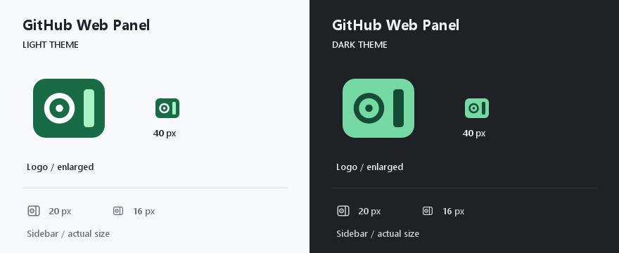

# Icon design

The original Issue-and-panel mark combines the circle-and-dot shape of an open issue with a vertical docked pane. The plugin logo uses green; the sidebar keeps the same silhouette in the IDE's monochrome palette. These SVGs are original project artwork covered by the repository's MIT license.

- `META-INF/pluginIcon.svg` and `pluginIcon_dark.svg`: 40 px logos with transparent margins, for the plugin manager and Marketplace.
- `icons/github-panel.svg` and `_dark.svg`: base 16 px sidebar resources.
- `icons/expui/github-panel.svg`, `@20x20.svg` and their dark variants: independently drawn 16/20 px New UI resources.
- `GitHubPanelIconMappings.json`: routes the existing tool-window icon path to the New UI variants.

Sizes, suffixes, mapping registration and sidebar colors follow JetBrains' [Working with Icons](https://plugins.jetbrains.com/docs/intellij/icons.html) and [Plugin Logo](https://plugins.jetbrains.com/docs/intellij/plugin-icon-file.html) guidance. The prescribed sidebar colors allow the platform to recolor selected icons.

Preview generated on 2026-09-03 with `SVGLoader` from Rider 2026.2.1, using the exact resource SVGs. The logo is shown enlarged and at 40 px; sidebar icons are shown at 20/16 px. This is a rendered artwork preview, not a screenshot of an installed plugin. A subsequent ordinary Rider pass confirmed the dark logo, sidebar icon and white-on-blue active state; see [acceptance scope](../validation/ICONS-beta.6.md).
